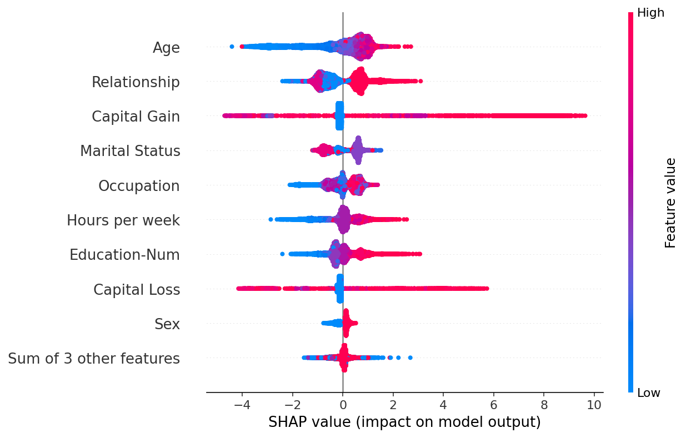
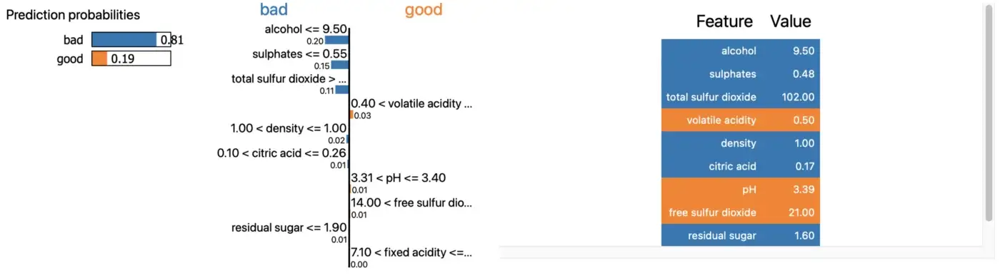
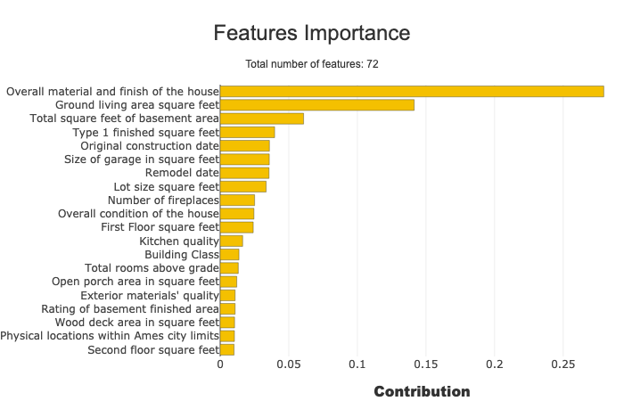
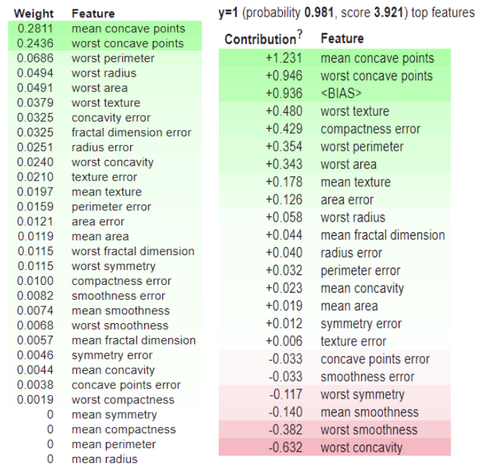
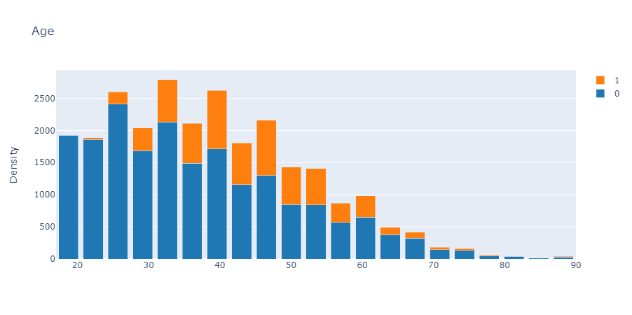
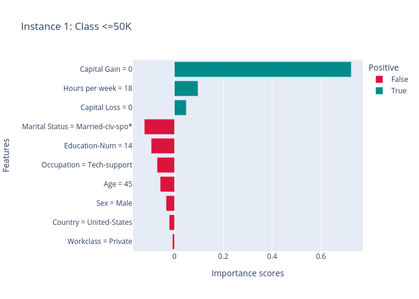

> Sayfanın github reposuna buradan ulaşabilirsiniz 
[Github Linki](https://github.com/yalcinhayyam/xai)

[XAI (Explainable AI)](#xai-explainable-ai)

- [SHAP](#shap)
  1. [Shap Nedir?](#shap-nedir)
  2. [Örnek](#örnek)
- [LIME](#lime)
  1. [Lime Nedir?](#lime-nedir)
  2. [Örnek](#c3b6rnek-1)
- [Shapash](#shapash)
  1. [Shapash Nedir?](#shapash-nedir)
  2. [Örnek](#c3b6rnek-2)
- [ELI5](#eli5)
  1. [ELI5 Nedir?](#eli5-nedir)
  2. [Örnek](#c3b6rnek-3)
- [InterpretML](#interpretml)
  1. [InterpretML Nedir?](#interpretml-nedir)
  2. [Örnek](#c3b6rnek-4)
- [OmniXAI](#omnixai)
  1. [OmniXAI Nedir?](#omnixai-nedir)
  2. [Örnek](#c3b6rnek-5)

# XAI (Explainable AI)

> Açıklanabilir AI (XAI), çözümün sonuçlarının insan uzmanlar tarafından anlaşılabilmesi için yapay zeka teknolojisinin (AI) uygulanmasındaki yöntem ve teknikleri ifade eder. Yapay zekanın neden belirli bir karara vardığını tasarımcılarının bile açıklayamadığı makine öğrenimindeki "kara kutu" kavramıyla çelişir.

2 açıklanabilirlik yöntemi:

- Modele özgü (içsel): Modele özgü yorumlanabilirlik yöntemleri, belirli model sınıflarıyla sınırlıdır. İçsel yöntemler, tanımı gereği modele özgüdür.

- Modelden bağımsız (post-hoc): Modelden bağımsız yöntemler, belirli bir makine öğrenimi modeline bağlı değildir. Modelden bağımsız yorumlar genellikle post-hoc'tur.

2 tür yorumlama:

- Yerel: Belirli bir tahminin nasıl ve neden yapıldığını açıklayın

- Global: Bir modelin genel olarak nasıl çalıştığını açıklayın
  Modelinizin ortalama olarak neyi önemsediği ve bunların sonucu nasıl etkilediği

---

## SHAP

### Shap Nedir?

SHAP (SHapley Additive ExPlanations), herhangi bir makine öğrenimi modelinin çıktısını açıklamaya yönelik oyun kuramsal bir yaklaşımdır. Oyun teorisindeki klasik Shapley değerlerini ve bunların ilgili uzantılarını kullanan yerel açıklamalarla optimum kredi tahsisini birleştirir.

SHAP' ı kurmak için, terminalde bu kodları çalıştırmamız yeterlidir

```bash
!pip install shap
```



### Örnek

[Tam Örnek Dökümanı >](https://shap-lrjball.readthedocs.io/en/latest/example_notebooks/plots/beeswarm.html)

Klasik UCI yetişkin geliri veri kümesi üzerinde eğitilmiş bir XGBoost modeli kullanır (bu, insanların 1990'larda 50.000 doların üzerinde kazanıp kazanmadığını tahmin etmek için bir sınıflandırma görevidir).

Beeswarm çizimi, bir veri kümesindeki en önemli özelliklerin modelin çıktısını nasıl etkilediğine dair bilgi açısından yoğun bir özet görüntülemek için tasarlanmıştır. Verilen açıklamanın her örneği, her özellik akışında tek bir nokta ile temsil edilir. Noktanın x konumu, o özelliğin SHAP değeri (shap_values.value[instance,feature]) tarafından belirlenir ve noktalar, yoğunluğu göstermek için her bir özellik satırı boyunca "yığılır". Renk, bir özelliğin orijinal değerini görüntülemek için kullanılır (shap_values.data[örnek,özellik]). Aşağıdaki çizimde, Yaşın ortalama olarak en önemli özellik olduğunu ve genç (mavi) insanların 50.000 doları aşma olasılığının daha düşük olduğunu görebiliriz.

```bash
!pip install xgboost
```

```py
# shap.plots.beeswarm
import xgboost
import shap

# train XGBoost model
X,y = shap.datasets.adult()
model = xgboost.XGBClassifier().fit(X, y)

# compute SHAP values
explainer = shap.Explainer(model, X)
shap_values = explainer(X)
```

```PY
shap.plots.beeswarm(shap_values)
```

---

## LIME

### Lime Nedir?

LIME kısaltması, Yerel Yorumlanabilir Model-agnostik Açıklamalar anlamına gelir. Proje, makine öğrenimi modellerinin ne yaptığını açıklamakla ilgilidir (kaynak). LIME tablo modelleri, metin sınıflandırıcılar ve görüntü sınıflandırıcılar (şu anda) için açıklamaları destekler.

Lime' ı kurmak için, terminalde bu kodları çalıştırmamız yeterlidir

```bash
pip install lime
```



### Örnek

[Tam Örnek Dökümanı >](https://towardsdatascience.com/lime-how-to-interpret-machine-learning-models-with-python-94b0e7e4432e)

[Şarap Kalitesi Data Seti >](https://www.kaggle.com/datasets/piyushagni5/white-wine-quality)

Bir modeli eğitmeden önce yorumlayamazsınız, bu yüzden ilk adım budur. Şarap kalitesi veri setinin eğitilmesi kolaydır ve bir dizi yorumlanabilir özellikle birlikte gelir. Python'a nasıl yükleyeceğiniz aşağıda açıklanmıştır

```py
import numpy as np
import pandas as pd

wine = pd.read_csv('wine.csv')
wine.head()
```

Tüm nitelikler sayısaldır ve eksik değer yoktur, bu nedenle listeden çapraz veri hazırlığı yapabilirsiniz.

Eğitim/Test ayrımı bir sonraki adımdır. Sütun kalitesi, olası iyi ve kötü değerleri ile hedef değişkendir. Aynı bölünmeyi elde etmek istiyorsanız, random_state parametresini 42 olarak ayarlayalım.

```py
from sklearn.model_selection import train_test_split

X = wine.drop('quality', axis=1)
y = wine['quality']

X_train, X_test, y_train, y_test = train_test_split(
    X, y, test_size=0.2, random_state=42
)
```

Geriye kalan tek şey maket eğitimi. ScikitLearn'den RandomForestClassifier bu işi yapacak ve onu eğitim setine sığdırmanız gerekecek. Kutudan çıkar çıkmaz %80 doğruluğa sahip bir sınıflandırıcı alacaksınız (score)

```py
from sklearn.ensemble import RandomForestClassifier

model = RandomForestClassifier(random_state=42)
model.fit(X_train, y_train)
score = model.score(X_test, y_test)
```

#### Model interpretation

Modeli açıklamaya başlamak için önce LIME kitaplığını içe aktarmanız ve tablo şeklinde bir açıklayıcı nesne oluşturmanız gerekir. Aşağıdaki parametreleri bekler

- training_data – eğitim/test bölümüyle oluşturulan eğitim verilerimiz. Numpy dizi biçiminde olmalıdır.
- feature_names – eğitim kümesindeki sütun adları
- class_names – hedef değişkenden farklı sınıflar
- mode – çözdüğünüz problemin türü (bu durumda sınıflandırma)

Here’s the code

```py
import lime
from lime import lime_tabular

explainer = lime_tabular.LimeTabularExplainer(
    training_data=np.array(X_train),
    feature_names=X_train.columns,
    class_names=['bad', 'good'],
    mode='classification'
)
```

İşte bu kadar

- yorumlamaya başlayabilirsiniz! Önce kötü bir şarap gelir. Test setinin ikinci satırı, kötü olarak sınıflandırılan şarabı temsil eder. Tahmini açıklamak için açıklayıcı nesnenin açıklayıcı örnek işlevini çağırabilirsiniz. Aşağıdaki parametreler gereklidir:

- data_row - veri kümesinden tek bir gözlem
- predict_fn – tahmin yapmak için kullanılan bir işlev. Modelden predict_proba, olasılıkları gösterdiği için harika bir seçenektir.

İşte kod

```py
exp = explainer.explain_instance(
    data_row=X_test.iloc[1],
    predict_fn=model.predict_proba
)
```

```py
exp.show_in_notebook(show_table=True)
```

---

## Shapash

### Shapash Nedir?

Shapash, makine öğrenimini herkes tarafından yorumlanabilir ve anlaşılır hale getirmeyi amaçlayan bir Python kitaplığıdır. Herkesin anlayabileceği açık etiketleri görüntüleyen çeşitli görselleştirme türleri sağlar.

Shapash' ı kurmak için, terminalde bu kodları çalıştırmamız yeterlidir

```bash
pip install shapash
```



### Örnek

[Tam Örnek Dökümanı >](https://shapash.readthedocs.io/en/latest/tutorials/tutorial02-Shapash-overview-in-Jupyter.html)

[Ev Fiyatları Data Seti >](https://www.kaggle.com/competitions/house-prices-advanced-regression-techniques/data)

```py
import pandas as pd
from category_encoders import OrdinalEncoder
from lightgbm import LGBMRegressor
from sklearn.model_selection import train_test_split
```

```py
from shapash.data.data_loader import data_loading
house_df, house_dict = data_loading('house_prices')
```

```py
y_df=house_df['SalePrice'].to_frame()
X_df=house_df[house_df.columns.difference(['SalePrice'])]
```

```py
house_df.head()
```

```py
from category_encoders import OrdinalEncoder

categorical_features = [col for col in X_df.columns if X_df[col].dtype == 'object']

encoder = OrdinalEncoder(
    cols=categorical_features,
    handle_unknown='ignore',
    return_df=True).fit(X_df)

X_df=encoder.transform(X_df)
```

```py
Xtrain, Xtest, ytrain, ytest = train_test_split(X_df, y_df, train_size=0.75, random_state=1)
```

```py
regressor = LGBMRegressor(n_estimators=200).fit(Xtrain,ytrain)
y_pred = pd.DataFrame(regressor.predict(Xtest),columns=['pred'],index=Xtest.index)
```

```py
from shapash import SmartExplainer

xpl = SmartExplainer(
    model=regressor,
    preprocessing=encoder, # Optional: compile step can use inverse_transform method
    features_dict=house_dict  # Optional parameter, dict specifies label for features name
)

xpl.compile(x=Xtest,
 y_pred=y_pred,
 y_target=ytest, # Optional: allows to display True Values vs Predicted Values
 )
```

```py
xpl.plot.features_importance()
```

---

## ELI5

### ELI5 Nedir?

ELI5, çeşitli Makine Öğrenimi modellerini görselleştirmek ve hata ayıklamak için tek tip bir API kullanan bir Python araç setidir. Tüm scikit-learn algoritmalarını destekler (fit() ve predict() yöntemleri dahil). Çok sayıda makine öğrenimi çerçevesi için yerleşik destek içerir ve beyaz kutu modellerini (Doğrusal Regresyon, Karar Ağaçları) ve kara kutu modellerini (Keras, XGBoost, LightGBM) açıklamanıza olanak tanır. Hem regresyon hem de sınıflandırma modellerine uygulanabilir.

ELI5' ı kurmak için, terminalde bu kodları çalıştırmamız yeterlidir

```bash
!pip install eli5
```



### Örnek

[Tam Örnek Dökümanı >](https://analyticsindiamag.com/how-to-visualize-and-debug-machine-learning-models-using-eli5/)

```py
from xgboost import XGBClassifier
import eli5
from sklearn.datasets import load_breast_cancer
from sklearn.model_selection import train_test_split
import pandas as pd
import numpy as np
```

> Burada kullandığımız veri seti, uygularken göğüs kanseri tahmini için yerleşik sklearn veri setidir. Uygun başlık ile meme kanseri veri seti için bir pandas veri çerçevesi oluşturun, bunun nedeni, eli5'i çalıştırdığımızda, özellik bilgilerini modelden almasıdır.

```py
data = load_breast_cancer()
df = pd.DataFrame(data.data)
df.columns = data.feature_names
df['target'] = data.target
```

Bir sınıflandırıcı oluşturalım

```py
model = XGBClassifier()
model.fit(x_train,y_train)
```

Şimdi aşağıdaki gibi ELI5'in sadece iki basit işlevsel API'sini kullanmamız gerekiyor.

```py
eli5.show_weights(model, top=30)
eli5.explain_prediction_xgboost(model,x_test.iloc[0])
```

> Sol taraf, her özellik için atanan ağırlıkları gösterir ve sağ taraf, bir örnek için tahmini gösterir.

> Yukarıdaki iki tablodan görebileceğiniz gibi, XGBoost'un eğitim verilerine dayalı olarak her özellik için nasıl ağırlık atadığını ve diğer tablodan, belirli bir örnek için, her bir özelliğin nasıl katkıda bulunduğu sınıf 1 için 0,981 olasılığa ulaşmak için nasıl atadığını görebileceğiniz gibi.

---

## InterpretML

### InterpretML Nedir?

InterpretML, en yeni makine öğrenimi yorumlanabilirlik tekniklerini tek bir çatı altında birleştiren açık kaynaklı bir pakettir. Bu paket ile yorumlanabilir cam kutu modelleri eğitebilir ve kara kutu sistemlerini anlatabilirsiniz. InterpretML, modelinizin genel davranışını veya bireysel tahminlerin arkasındaki nedenleri anlamanıza yardımcı olur.

InterpretML' ı kurmak için, terminalde bu kodları çalıştırmamız yeterlidir

```bash
pip install interpret
```



### Örnek

[Tam Örnek Dökümanı >](https://github.com/interpretml/interpret)

[Jupyter Dökümanı >](https://nbviewer.org/github/interpretml/interpret/blob/master/benchmarks/EBM%20Classification%20Comparison.ipynb)

[Yetişkin Listesi Data Seti >](https://archive.ics.uci.edu/ml/machine-learning-databases/adult/)

Klasik UCI yetişkin geliri veri kümesi üzerinde eğitilmiş bir XGBoost modeli kullanır (bu, insanların 1990'larda 50.000 doların üzerinde kazanıp kazanmadığını tahmin etmek için bir sınıflandırma görevidir).

InterpretML, bir veri kümesindeki en önemli özelliklerin modelin çıktısını nasıl etkilediğine dair yoğun bilgi içeren bir özet görüntülemek üzere tasarlanmıştır. Aşağıdaki çizimde, Yaşın ortalama olarak en önemli özellik olduğunu ve gençlerin 50.000 doları aşma olasılığının daha düşük olduğunu görebiliriz.

```py
import pandas as pd
from sklearn.model_selection import train_test_split

df = pd.read_csv(
    "https://archive.ics.uci.edu/ml/machine-learning-databases/adult/adult.data",
    header=None)
df.columns = [
    "Age", "WorkClass", "fnlwgt", "Education", "EducationNum",
    "MaritalStatus", "Occupation", "Relationship", "Race", "Gender",
    "CapitalGain", "CapitalLoss", "HoursPerWeek", "NativeCountry", "Income"
]
# df = df.sample(frac=0.1, random_state=1)
train_cols = df.columns[0:-1]
label = df.columns[-1]
X = df[train_cols]
y = df[label].apply(lambda x: 0 if x == " <=50K" else 1) #Turning response into 0 and 1

seed = 1
X_train, X_test, y_train, y_test = train_test_split(X, y, test_size=0.20, random_state=seed)
```

```py
from interpret import show
from interpret.data import ClassHistogram

hist = ClassHistogram().explain_data(X_train, y_train, name = 'Train Data')
show(hist)
```

---

## OmniXAI

### OmniXAI Nedir?

OmniXAI (Omni eXplainable AI'nin kısaltması), pratikte makine öğrenimi modelleri tarafından alınan kararları açıklamada birçok sıkıntılı noktayı ele almak için çok yönlü açıklanabilir yapay zeka ve yorumlanabilir makine öğrenimi yetenekleri sunan, açıklanabilir yapay zeka (XAI) için bir Python makine öğrenimi kitaplığıdır. OmniXAI, ML sürecinin farklı aşamalarında çeşitli veri türleri, modeller ve açıklama yöntemleri için açıklamaya ihtiyaç duyan veri bilimcileri, ML araştırmacıları ve uygulayıcılar için açıklanabilir yapay zekayı kolaylaştıran tek noktadan kapsamlı bir kitaplık olmayı amaçlamaktadır:

```bash
pip install omnixai
```



### Örnek

[Tam Örnek Dökümanı >](https://github.com/salesforce/OmniXAI)

[Yetişkin Listesi Data Seti >](https://archive.ics.uci.edu/ml/machine-learning-databases/adult/)

Örnek olarak gelir tahmini görevini ele alalım. Bu örnekte kullanılan veri seti, gelir tahmini içindir. Tablolu bir veri kümesini temsil etmek için Tabular veri sınıfını kullanmanızı öneririz. Pandas veri çerçevesi verilen bir Tabular örneği oluşturmak için veri çerçevesini, kategorik özellik adlarını (varsa) ve hedef/etiket sütun adını (varsa) belirtmeniz gerekir.

[Omnixai Tabular Örneği>](https://github.com/salesforce/OmniXAI/blob/main/tutorials/tabular_classification.ipynb)

```py
# This default renderer is used for sphinx docs only. Please delete this cell in IPython.
import plotly.io as pio
pio.renderers.default = "png"
```

```py
import os
import sklearn
import sklearn.datasets
import sklearn.ensemble
import xgboost
import numpy as np
import pandas as pd

from omnixai.data.tabular import Tabular
from omnixai.preprocessing.tabular import TabularTransform
from omnixai.explainers.tabular import TabularExplainer
from omnixai.visualization.dashboard import Dashboard
```

```py

# Load the dataset
feature_names = [
    "Age", "Workclass", "fnlwgt", "Education",
    "Education-Num", "Marital Status", "Occupation",
    "Relationship", "Race", "Sex", "Capital Gain",
    "Capital Loss", "Hours per week", "Country", "label"
]
df = pd.DataFrame(
    np.genfromtxt(os.path.join('data', 'adult.data'), delimiter=', ', dtype=str),
    columns=feature_names
)
tabular_data = Tabular(
    data=df,
    categorical_columns=[feature_names[i] for i in [1, 3, 5, 6, 7, 8, 9, 13]],
    target_column='label'
)
print(tabular_data)
```

```py
# Train an XGBoost model
np.random.seed(1)
transformer = TabularTransform().fit(tabular_data)
class_names = transformer.class_names
x = transformer.transform(tabular_data)
train, test, train_labels, test_labels = \
    sklearn.model_selection.train_test_split(x[:, :-1], x[:, -1], train_size=0.80)
print('Training data shape: {}'.format(train.shape))
print('Test data shape:     {}'.format(test.shape))

gbtree = xgboost.XGBClassifier(n_estimators=300, max_depth=5)
gbtree.fit(train, train_labels)
print('Test accuracy: {}'.format(
    sklearn.metrics.accuracy_score(test_labels, gbtree.predict(test))))

# Convert the transformed data back to Tabular instances
train_data = transformer.invert(train)
test_data = transformer.invert(test)
```

> TabularExplainer'ı başlatmak için aşağıdaki parametreleri ayarlamamız gerekir:

> - explainers: Uygulanacak açıklayıcıların adları, örneğin, ["lime", "shap", "mace", "pdp"].

> - data: Açıklayıcıları başlatmak için kullanılan veriler. data, makine öğrenimi modelini eğitmek için eğitim veri kümesidir. Eğitim veri kümesi çok büyükse, omnixai.sampler.tabular.Sampler.subsample uygulanarak veriler bunun bir alt kümesi olabilir.

> - model: Açıklanacak makine öğrenimi modeli, örneğin bir scikit-learn modeli, bir tensorflow modeli, bir pytorch modeli veya bir kara kutu tahmin işlevi.

> - preprocess: Ham verileri (Tablo örneği) modelin girdilerine dönüştüren önişleme işlevi.
>   son işlem (isteğe bağlı): Modelin çıktılarını kullanıcıya özel bir forma, örneğin her sınıf için tahmin edilen olasılığa dönüştüren son işleme işlevi. Son işlemin çıktısı bir numpy dizisi olmalıdır.

> - mode: Görev türü, ör. "sınıflandırma" veya "gerileme".
>   Ön işleme işlevi, girdi olarak bir Tabular örneğini alır ve makine öğrenimi modelinin tükettiği işlenmiş özelliklerin çıktısını verir. Bu örnekte, basitçe transformator.transform diyoruz. Panda veri çerçevelerinde bazı özel dönüşümler kullanılıyorsa, önişleme işlevi şu türde bir biçime sahiptir: lambda z: some_transform(z.to_pd()).

```py
preprocess = lambda z: transformer.transform(z)
```

```py
# Initialize a TabularExplainer
explainers = TabularExplainer(
    explainers=["lime", "shap", "mace", "pdp", "ale"],
    mode="classification",
    data=train_data,
    model=gbtree,
    preprocess=preprocess,
    params={
        "lime": {"kernel_width": 3},
        "shap": {"nsamples": 100},
        "mace": {"ignored_features": ["Sex", "Race", "Relationship", "Capital Loss"]}
    }
)
# Generate explanations
test_instances = test_data[1653:1658]
local_explanations = explainers.explain(X=test_instances)
global_explanations = explainers.explain_global(
    params={"pdp": {"features": ["Age", "Education-Num", "Capital Gain",
                                 "Capital Loss", "Hours per week", "Education",
                                 "Marital Status", "Occupation"]}}
)
```

```py

index=1
print("LIME results:")
local_explanations["lime"].ipython_plot(index, class_names=class_names)
print("SHAP results:")
local_explanations["shap"].ipython_plot(index, class_names=class_names)
print("MACE results:")
local_explanations["mace"].ipython_plot(index, class_names=class_names)
print("PDP results:")
global_explanations["pdp"].ipython_plot(class_names=class_names)
print("ALE results:")
global_explanations["ale"].ipython_plot(class_names=class_names)
```

<https://colab.research.google.com/github/kweinmeister/notebooks/blob/master/tensorflow-shap-college-debt.ipynb>
